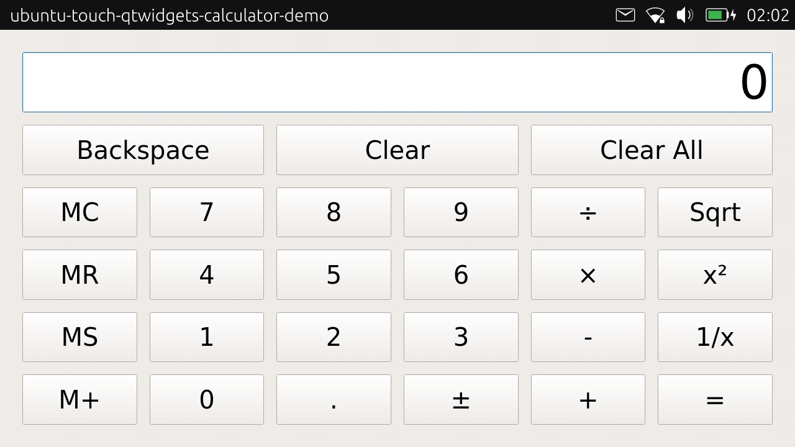

# QtWidgets Calculator demo - ported on Ubuntu Touch

The example forked from [ubuntu-touch-qtwidgets-calculator-demo](https://github.com/sverzegnassi/ubuntu-touch-qtwidgets-calculator-demo), shows how to use signals and slots to implement the functionality of a calculator widget, and how to use QGridLayout to place child widgets in a grid.

### Original demo:

[Qt docs](http://doc.qt.io/qt-5/qtwidgets-widgets-calculator-example.html)
